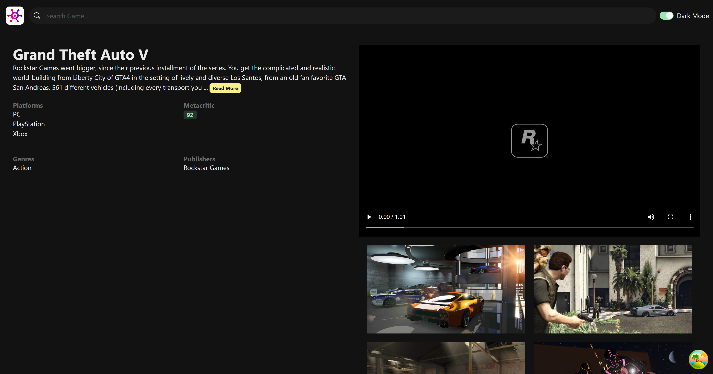

<h1 align="center">Game Hub</h1>

## 📖 Description
> This Project is create Game list website by using API from RAWG. The website will list the games with genres and platforms sorting feature.

## Previews
|  <br> <center>**Home Page**</center> |  <br> <center>**Game Detail Page**</center> |
| :-: | :-: |

## 🧰 Built with
[](https://skillicons.dev)

## 📝Usage
### Requirement
This project use `Node.js` with `TypsScript` to compile source code

1. First, We need the API key from from RAWG. Access via link below and register for get the API key.
https://rawg.io/apidocs

2. Create `.env` file and put you key there.
```env
# .env
VITE_RAWG_API_KEY=<place key here>
```

3. Install dependency modules.
```shell
npm i
```

### Running Server
Run server
```shell
npm run dev
```

## 📋Reference
This project is build by learning from the course Ultimate React course by Mosh Hamedani. You can find the full course at: https://codewithmosh.com